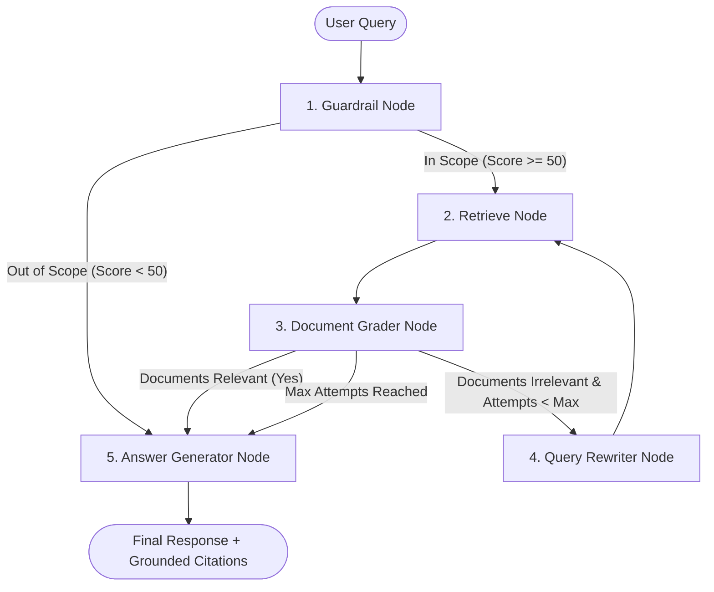

<div align="center">

# 🔬 Self-Correcting RAG for Scientific Literature

### *An Autonomous Agentic Retrieval-Augmented Generation Platform for arXiv Research Papers*

[](https://www.python.org/)
[](https://fastapi.tiangolo.com/)
[](https://langchain-ai.github.io/langgraph/)
[](https://opensearch.org/)
[](https://groq.com/)
[-blueviolet.svg)](https://jina.ai/)
[](https://langfuse.com/)
[](./LICENSE)
[]()

<br/>

**[ 🚀 Quick Start ](#-quick-start)** &nbsp;•&nbsp;
**[ 🔄 Reasoning Graph ](#-agentic-reasoning-workflow)** &nbsp;•&nbsp;
**[ 🏛️ Architecture ](#-architecture-overview)** &nbsp;•&nbsp;
**[ 🖥️ Interfaces ](#-usage-interfaces)** &nbsp;•&nbsp;
**[ 📖 Full User Guide ](./USER_GUIDE.md)** &nbsp;•&nbsp;
**[ 🔌 API Docs ](#3-fastapi-rest-endpoints)**

<br/>

---

</div>

## 🌟 Key Capabilities

- 🧠 **Corrective RAG (CRAG) Reasoning**: Orchestrated with **LangGraph** `StateGraph`, utilizing **LLM-as-a-Judge document grading** and automatic **query reformulation loops** to eliminate hallucinations.
- 🛡️ **Domain Guardrail Filter**: Input validation gate scoring incoming queries (0–100) to ensure questions remain strictly focused on technical disciplines.
- 🔍 **Reciprocal Rank Fusion (RRF)**: OpenSearch hybrid search combining BM25 keyword matching (`title^2.0`, `abstract^1.5`, `chunk_text`) with 1024-dimensional dense vectors from **Jina Embeddings v3**.
- 📥 **Automated Ingestion Pipeline**: Queries official arXiv Atom XML feeds with exponential backoff, parses complex PDFs to Markdown using **IBM Docling**, and splits text into section-aware overlapping chunks.
- 🔌 **4 Native Interfaces**:
  - 🌐 **Gradio Web Interface**: Interactive multi-tab research chat with multi-PDF upload and transparent reasoning logs.
  - ⚡ **FastAPI REST API**: Production JSON endpoints with OpenAPI `/docs` and dependency injection.
  - 💻 **Typer & Rich CLI**: Direct terminal command execution for search, ingestion, and research Q&A.
  - 📱 **Telegram Bot**: Long-polling assistant bot for mobile access.
- 📊 **Complete Observability**: Native integration with **Langfuse v3** for automated trace logging, latency tracking, and feedback collection.

---

## 🔄 Agentic Reasoning Workflow



---

## 🏛️ Architecture Overview

```text
agentic_research_assistant/
├── data/                            # Persistent local storage (SQLite DB, vector JSON fallback)
├── src/
│   ├── config/                      # Pydantic v2 Settings (.env parsing & validation)
│   ├── domain/                      # Domain entities (Paper, Chunk, SearchHit) & schemas
│   ├── storage/                     # Storage layer
│   │   ├── database/                # SQLite & PostgreSQL repositories
│   │   └── vector_store/            # OpenSearch & Local Memory vector stores
│   ├── ingestion/                   # Automated Ingestion Pipeline
│   │   ├── arxiv_client.py          # Paper harvester & PDF downloader with exponential backoff
│   │   ├── pdf_parser.py            # IBM Docling markdown/section extractor
│   │   ├── chunker.py               # Section-aware hybrid text chunker
│   │   └── pipeline.py              # Ingestion coordinator & batch indexer
│   ├── services/                    # Shared providers (Groq/Ollama LLM, Jina Embeddings, Cache, Langfuse)
│   ├── agents/                      # LangGraph Self-Correcting RAG
│   │   ├── state.py                 # Graph state & structured schemas
│   │   ├── workflow.py              # Compiled LangGraph StateGraph engine
│   │   └── nodes/                   # Guardrail, Retrieve, Grader, Rewriter, Generator
│   └── interfaces/                  # Multi-Channel Entrypoints
│       ├── api/                     # FastAPI REST API (/docs)
│       ├── cli/                     # Rich CLI (ingest, search, ask, serve, ui)
│       ├── ui/                      # Gradio Web Interface
│       └── bot/                     # Telegram Assistant Bot
```

---

## ⚡ Quick Start

### 1. Prerequisites
- Python `3.12+`
- [UV](https://docs.astral.sh/uv/) (Recommended) or standard `pip`
- [Groq API Key](https://console.groq.com/keys) (Free & fast cloud inference)
- [Jina API Key](https://jina.ai/embeddings/) (Free tier for dense embeddings)

### 2. Installation & Setup
```bash
# 1. Clone the repository
git clone https://github.com/your-username/agentic-research-assistant.git
cd agentic-research-assistant

# 2. Copy and configure environment variables
cp .env.example .env

# 3. Open .env and add your API keys:
# GROQ_API_KEY=your_groq_api_key_here
# JINA_API_KEY=your_jina_api_key_here

# 4. Install dependencies
uv sync
```

---

## 🖥️ Usage Interfaces

### 1. Gradio Web Interface (Recommended)
```bash
python -m src.interfaces.cli.main ui --port 7860
```
Open **`http://localhost:7860`** in your browser to access the visual research playground, upload custom PDFs, and inspect reasoning traces in real time.

---

### 2. Command-Line Interface (CLI)

```bash
# Ingest 5 papers on AI directly from arXiv
python -m src.interfaces.cli.main ingest --query "cat:cs.AI" --limit 5

# Search indexed chunks using Hybrid search (BM25 + Dense Vectors)
python -m src.interfaces.cli.main search "attention mechanism" --mode hybrid --top-k 3

# Ask a research question with LangGraph reasoning & Groq LLM
python -m src.interfaces.cli.main ask "How does chain-of-thought monitoring prevent AI misalignment?"

# Start FastAPI server
python -m src.interfaces.cli.main serve --port 8000
```

---

### 3. FastAPI REST Endpoints

Start the API:
```bash
python -m src.interfaces.cli.main serve --port 8000
```
- **Interactive OpenAPI Documentation**: `http://localhost:8000/docs`
- `POST /api/v1/ask` — Submit questions to the full agentic reasoning loop
- `POST /api/v1/search` — Direct hybrid / BM25 / k-NN search across indexed literature
- `POST /api/v1/ingest` — Programmatically trigger arXiv ingestion
- `POST /api/v1/feedback` — Submit feedback scores to Langfuse
- `GET /api/v1/health` — Check database and vector store health

---

### 4. Telegram Bot (Mobile Access)

Set `TELEGRAM_ENABLED=true` and your `TELEGRAM_BOT_TOKEN` in `.env`, then run:
```bash
python -m src.interfaces.bot.bot
```

---

## ⚙️ Configuration Reference

| Environment Variable | Default | Options | Description |
|---|---|---|---|
| `LLM_PROVIDER` | `groq` | `groq`, `ollama`, `openai` | Primary LLM inference provider |
| `GROQ_MODEL` | `llama-3.3-70b-versatile` | Any Groq model | Target cloud LLM |
| `DATABASE_TYPE` | `sqlite` | `sqlite`, `postgresql` | Relational metadata store |
| `VECTOR_STORE_TYPE` | `opensearch` | `opensearch`, `memory` | Vector storage & search engine |
| `EMBEDDING_MODEL` | `jina-embeddings-v3` | Jina / HuggingFace | Dense vector embedding model (1024-dim) |
| `CACHE_TYPE` | `memory` | `memory`, `redis` | Query response caching layer |
| `LANGFUSE_ENABLED` | `false` | `true`, `false` | Observability & execution tracing |

---

## 🧪 Testing

Run the automated test suite with pytest:
```bash
pytest tests/ -v
```

---

## 📄 License

This project is licensed under the **MIT License** — see the [LICENSE](./LICENSE) file for details.
